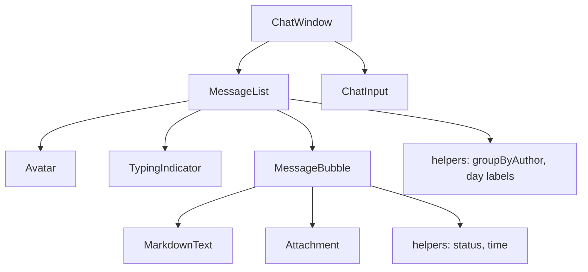

<div align="center">


# react-chat-ui

### A composable, strict-typed chat UI kit for React — bubbles, avatars, typing, status, attachments & safe markdown.

**Built and maintained by [Viprasol Tech](https://viprasol.com)**

[](https://www.npmjs.com/package/react-chat-ui)
[](LICENSE)
[](tsconfig.json)
[](https://react.dev)
[](src/__tests__)
[](CONTRIBUTING.md)

</div>

---

A small, dependency-free set of React components for building chat surfaces:
a full `ChatWindow`, a grouped `MessageList`, individual `MessageBubble`s, and a
controlled `ChatInput`. Everything is strict-typed, accessible, and styled with
plain class hooks (`rcui-*`) so you can drop in your own CSS.

## Features

- Composable - use the full `ChatWindow` or wire the primitives yourself.
- Avatars - image with automatic colored-initials fallback (and on error).
- Typing indicator - animated dots with a smart, accessible label.
- Delivery status - `sending` / `sent` / `delivered` / `read` / `error` ticks.
- Day separators - "Today", "Yesterday", or a localized date.
- Attachments - image thumbnails, file download chips, staged-chip composer.
- Safe markdown - `**bold**`, `*italic*`, `` `code` ``, links; never renders raw HTML.
- Auto-scroll - sticks to the newest message as the log grows.
- Accessible - ARIA live regions, labeled controls, keyboard send (Enter / Shift+Enter).
- Strict TypeScript - full types exported, zero `any`.

## Install

```bash
npm install react-chat-ui
# peer deps
npm install react react-dom
```

## Usage

```tsx
import { useState } from "react";
import { ChatWindow, type ChatMessage } from "react-chat-ui";

export function Support() {
  const [messages, setMessages] = useState<ChatMessage[]>([
    {
      id: "1",
      role: "assistant",
      author: "Aria",
      avatarUrl: "/aria.png",
      content: "Hi! How can I help? You can use **bold** and `code`.",
      timestamp: Date.now(),
    },
  ]);
  const [typing, setTyping] = useState(false);

  function handleSend(text: string) {
    setMessages((prev) => [
      ...prev,
      {
        id: crypto.randomUUID(),
        role: "user",
        author: "You",
        content: text,
        timestamp: Date.now(),
        status: "sent",
      },
    ]);
    setTyping(true);
    // ...call your backend, then setTyping(false) and append the reply
  }

  return (
    <div style={{ height: 480 }}>
      <ChatWindow
        messages={messages}
        onSend={handleSend}
        typing={typing}
        typingWho="Aria"
        header={<strong>Customer Support</strong>}
        emptyState={<p>Say hello</p>}
      />
    </div>
  );
}
```

### Using the primitives directly

```tsx
import { MessageList, ChatInput, Avatar } from "react-chat-ui";

<MessageList messages={messages} typing typingWho="Aria" />;
<ChatInput onSend={send} onAttach={(files) => upload(files)} maxLength={2000} />;
<Avatar name="Ada Lovelace" src="/ada.png" size={40} />;
```

## Architecture



## Props / API

### `<ChatWindow>`

| Prop                 | Type                              | Default | Description                                  |
| -------------------- | --------------------------------- | ------- | -------------------------------------------- |
| `messages`           | `ChatMessage[]`                   | -       | Messages in chronological order.             |
| `onSend`             | `(text: string) => void`          | -       | Fired with trimmed text on submit.           |
| `onAttach`           | `(files: FileList) => void`       | -       | Enables the composer attachment button.      |
| `header`             | `ReactNode`                       | -       | Node above the message log.                  |
| `placeholder`        | `string`                          | -       | Composer placeholder.                        |
| `disabled`           | `boolean`                         | `false` | Disable the composer.                        |
| `showTimestamps`     | `boolean`                         | `true`  | Per-bubble time labels.                      |
| `showStatus`         | `boolean`                         | `true`  | Per-bubble delivery ticks.                   |
| `showAvatars`        | `boolean`                         | `true`  | Author avatars.                              |
| `showDateSeparators` | `boolean`                         | `true`  | "Today / Yesterday / date" rows.             |
| `plainText`          | `boolean`                         | `false` | Render content as plain text, not markdown.  |
| `typing`             | `boolean`                         | `false` | Show a trailing typing indicator.            |
| `typingWho`          | `string \| string[]`              | -       | Name(s) in the typing label.                 |
| `autoScroll`         | `boolean`                         | `true`  | Scroll to newest on update.                  |
| `pendingAttachments` | `ChatAttachment[]`                | -       | Staged composer chips.                       |
| `onRemoveAttachment` | `(id: string) => void`            | -       | Remove a staged chip.                        |
| `emptyState`         | `ReactNode`                       | -       | Shown when there are no messages.            |
| `className`          | `string`                          | -       | Extra root classes.                          |

### `<MessageBubble>`

| Prop            | Type           | Default | Description                            |
| --------------- | -------------- | ------- | -------------------------------------- |
| `message`       | `ChatMessage`  | -       | The message to render.                 |
| `showTimestamp` | `boolean`      | `true`  | Show the time label.                   |
| `showStatus`    | `boolean`      | `true`  | Show the delivery tick.                |
| `plainText`     | `boolean`      | `false` | Disable markdown rendering.            |
| `className`     | `string`       | -       | Extra root classes.                    |

### `<ChatInput>`

| Prop                 | Type                        | Default            | Description                          |
| -------------------- | --------------------------- | ------------------ | ------------------------------------ |
| `onSend`             | `(text: string) => void`    | -                  | Fired on submit.                     |
| `placeholder`        | `string`                    | `"Type a message"` | Field placeholder.                   |
| `disabled`           | `boolean`                   | `false`            | Disable field + button.              |
| `sendLabel`          | `string`                    | `"Send"`           | Button label.                        |
| `maxLength`          | `number`                    | -                  | Char limit + counter.                |
| `onAttach`           | `(files: FileList) => void` | -                  | Enables the attachment picker.       |
| `accept`             | `string`                    | all files          | File input `accept`.                 |
| `pendingAttachments` | `ChatAttachment[]`          | `[]`               | Removable staged chips.              |
| `onRemoveAttachment` | `(id: string) => void`      | -                  | Remove a staged chip.                |

### `<Avatar>`, `<TypingIndicator>`, `<Attachment>`, `<MarkdownText>`

| Component          | Key props                                   |
| ------------------ | ------------------------------------------- |
| `Avatar`           | `name?`, `src?`, `size?` (default `32`)     |
| `TypingIndicator`  | `who?: string \| string[]`                  |
| `Attachment`       | `attachment: ChatAttachment`                |
| `MarkdownText`     | `text: string`                              |

### Helpers

`groupByAuthor`, `formatTimestamp`, `getInitials`, `formatBytes`, `isSameDay`,
`formatDayLabel`, `statusLabel`, `statusGlyph`, `parseInlineMarkdown`.

## Roadmap

- [x] Typing indicator, delivery status, avatars
- [x] Attachments + safe inline markdown
- [x] Day separators + auto-scroll
- [ ] Virtualized message list for very long histories
- [ ] Emoji / reaction picker
- [ ] Themeable design tokens + dark mode preset
- [ ] Message editing & deletion affordances

## FAQ

**Does it ship CSS?** No - components emit `rcui-*` class hooks and minimal inline
layout. Bring your own styles for full control.

**Is the markdown renderer safe?** Yes. `parseInlineMarkdown` tokenizes a small,
fixed grammar and never produces raw HTML; links are limited to `http(s):` and
`mailto:`. `javascript:` URLs are rendered as plain text.

**Can I send attachment-only messages?** Yes - when attachments are staged, an
empty text body can still be submitted.

## Contributing

Contributions are welcome! Please read [CONTRIBUTING.md](CONTRIBUTING.md) and our
[Code of Conduct](CODE_OF_CONDUCT.md). Run `npm install`, then `npm run typecheck`
and `npm test` before opening a PR.

## Contact — Viprasol Tech Private Limited

- Website: [viprasol.com](https://viprasol.com)
- Email: [support@viprasol.com](mailto:support@viprasol.com)
- Telegram: [t.me/viprasol_help](https://t.me/viprasol_help) | WhatsApp: +91 96336 52112
- GitHub: [@Viprasol-Tech](https://github.com/Viprasol-Tech) | [LinkedIn](https://www.linkedin.com/in/viprasol/) | X [@viprasol](https://twitter.com/viprasol)

## License

[MIT](LICENSE) (c) 2025 Viprasol Tech Private Limited
